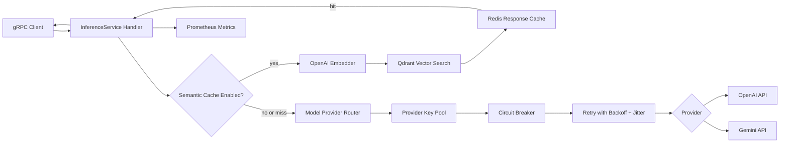
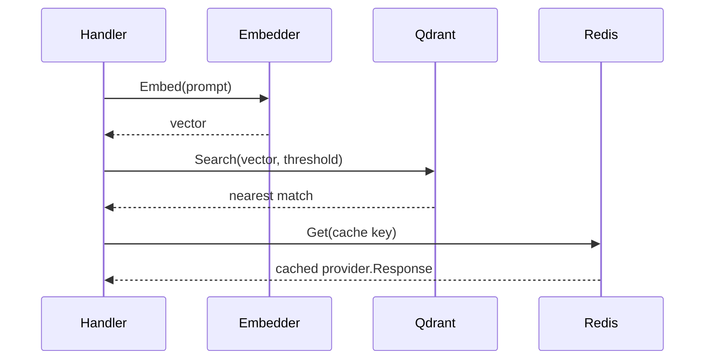

# LLM Inference Proxy - Technical Documentation

## 1. Overview

`llm-inference-proxy` is a Go-based gRPC inference gateway that sits between client applications and large language model providers. It exposes a single inference API while adding provider routing, API key rotation, semantic caching, retry behavior, circuit breaking, Prometheus metrics, containerization, and Kubernetes deployment manifests.

The proxy currently supports:

- Unary inference through `Infer`
- Server-side streaming inference through `InferStream`
- OpenAI Chat Completions API
- Google Gemini Generate Content API
- Semantic cache backed by OpenAI embeddings, Qdrant, and Redis
- Per-provider key pools
- Per-provider circuit breakers
- Exponential backoff retry with jitter
- Prometheus metrics and health checks

## 2. Project Structure

```text
llm-interference-proxy/
|-- cmd/
|   `-- proxy/
|       `-- main.go                 # Application entry point and dependency wiring
|-- pkg/
|   |-- cache/
|   |   |-- embedder.go             # OpenAI embedding API client
|   |   |-- redis_cache.go          # Redis response cache
|   |   |-- semantic_cache.go       # Semantic cache orchestration
|   |   `-- vector_store.go         # Qdrant vector search and upsert client
|   |-- metrics/
|   |   `-- metrics.go              # Prometheus counters, gauges, and histograms
|   |-- provider/
|   |   |-- gemini.go               # Gemini provider implementation
|   |   |-- openai.go               # OpenAI provider implementation
|   |   `-- provider.go             # Shared provider interface and request/response types
|   |-- proxy/
|   |   `-- handler.go              # gRPC service handler
|   `-- resilience/
|       |-- circuitbreaker.go       # Circuit breaker state machine
|       |-- keypool.go              # API key rotation and rate-limit awareness
|       `-- retry.go                # Retry helper with exponential backoff and jitter
|-- proto/
|   |-- proxy.proto                 # gRPC service and protobuf message definitions
|   |-- proxy.pb.go                 # Generated protobuf types
|   `-- proxy_grpc.pb.go            # Generated gRPC bindings
|-- k8s/
|   `-- deployment.yaml             # Kubernetes Deployment, Service, and HPA
|-- Dockerfile                      # Multi-stage container build
|-- go.mod                          # Go module definition
|-- go.sum                          # Go dependency lock file
`-- README.md                       # Existing project README
```

## 3. High-Level Architecture



The application has a simple layered architecture:

- `cmd/proxy` bootstraps configuration, dependencies, gRPC, metrics, and shutdown.
- `pkg/proxy` owns request handling and the end-to-end inference workflow.
- `pkg/provider` abstracts external LLM APIs behind a common interface.
- `pkg/cache` handles embedding, vector search, and response storage.
- `pkg/resilience` contains reusable resiliency components.
- `pkg/metrics` exposes Prometheus instrumentation.
- `proto` defines the public gRPC contract.
- `k8s` and `Dockerfile` provide deployment assets.

## 4. Runtime Components

### 4.1 Entry Point

File: `cmd/proxy/main.go`

The `main` function:

1. Reads configuration from environment variables.
2. Creates OpenAI and Gemini providers.
3. Creates API key pools from comma-separated key lists.
4. Creates circuit breakers for each provider.
5. Initializes semantic cache if `EMBEDDING_API_KEY` is configured and Redis is reachable.
6. Creates retry configuration.
7. Builds the gRPC handler.
8. Starts the gRPC server on `GRPC_PORT`.
9. Starts the metrics and health HTTP server on `METRICS_PORT`.
10. Handles graceful shutdown on `SIGINT` or `SIGTERM`.

### 4.2 gRPC API

File: `proto/proxy.proto`

The proxy exposes one service:

```protobuf
service InferenceService {
  rpc Infer(InferenceRequest) returns (InferenceResponse);
  rpc InferStream(InferenceRequest) returns (stream StreamChunk);
}
```

`InferenceRequest` contains:

- `model`
- `prompt`
- `temperature`
- `max_tokens`

`InferenceResponse` contains:

- generated text
- prompt token count
- output token count
- cache-hit flag
- end-to-end latency in milliseconds

`StreamChunk` contains:

- partial text
- final-chunk flag
- token counts, usually populated on the final chunk or when provided by the upstream provider

## 5. Request Flow

### 5.1 Unary Request Flow

File: `pkg/proxy/handler.go`

`Infer` handles a unary inference request as follows:

1. Increment `active_requests`.
2. Attach a request timeout using `context.WithTimeout`.
3. Resolve the provider from the model name.
4. Attempt semantic cache lookup if cache is enabled.
5. Return cached response immediately on hit.
6. Resolve provider implementation.
7. Fetch an API key from the provider key pool.
8. Build a provider request.
9. Execute provider call through circuit breaker and retry wrapper.
10. Record latency, token usage, and request status metrics.
11. Store the response in semantic cache asynchronously.
12. Return the gRPC response.

### 5.2 Streaming Request Flow

File: `pkg/proxy/handler.go`

`InferStream` handles server-side streaming:

1. Increment `active_requests`.
2. Attach a request timeout.
3. Resolve provider by model name.
4. Attempt semantic cache lookup.
5. If cache hit, send the cached response as a single final stream chunk.
6. Resolve provider and API key.
7. Call the provider streaming API.
8. Forward chunks to the gRPC stream.
9. Assemble full text while streaming.
10. Record metrics after stream completion.
11. Store the assembled response in semantic cache asynchronously.

Current implementation note: streaming provider calls do not use the retry or circuit-breaker wrapper used by unary calls.

## 6. Provider Architecture

### 6.1 Provider Interface

File: `pkg/provider/provider.go`

All LLM backends implement this interface:

```go
type Provider interface {
    Name() string
    Infer(ctx context.Context, req Request) (Response, error)
    InferStream(ctx context.Context, req Request) (<-chan StreamChunk, error)
}
```

This keeps the handler independent of provider-specific HTTP payloads.

### 6.2 OpenAI Provider

File: `pkg/provider/openai.go`

The OpenAI provider:

- Uses `https://api.openai.com/v1`
- Calls `/chat/completions` for unary inference
- Uses `stream: true` and reads Server-Sent Event style `data:` lines for streaming
- Sends the API key in the `Authorization: Bearer` header
- Maps OpenAI usage fields to proxy token fields

### 6.3 Gemini Provider

File: `pkg/provider/gemini.go`

The Gemini provider:

- Uses `https://generativelanguage.googleapis.com/v1beta`
- Calls `models/{model}:generateContent` for unary inference
- Calls `models/{model}:streamGenerateContent?alt=sse` for streaming
- Sends the API key as the `key` query parameter
- Maps Gemini usage metadata to proxy token fields

## 7. Provider Routing

File: `pkg/proxy/handler.go`

Provider routing is prefix based:

```text
gpt*     -> openai
gemini*  -> gemini
claude-* -> anthropic
default  -> openai
```

Only OpenAI and Gemini are currently registered in `main.go`. Although `claude-` routes to `anthropic`, no Anthropic provider is currently configured, so such requests return an unknown-provider error.

## 8. Semantic Cache Design

Files:

- `pkg/cache/semantic_cache.go`
- `pkg/cache/embedder.go`
- `pkg/cache/vector_store.go`
- `pkg/cache/redis_cache.go`

The semantic cache is designed to avoid repeated LLM calls for prompts that are semantically close to previous prompts.

### 8.1 Cache Lookup



Lookup flow:

1. Generate an embedding for the incoming prompt.
2. Search Qdrant for a similar vector above `SIMILARITY_THRESHOLD`.
3. If a similar vector exists, read the cached response from Redis.
4. If Redis contains the response, return a cache hit.
5. Any cache-layer failure is logged and treated as a cache miss.

### 8.2 Cache Store

Store flow:

1. Generate an embedding for the prompt.
2. Generate a deterministic Redis key from a SHA-256 hash of the prompt.
3. Store the provider response in Redis with `CACHE_TTL`.
4. Upsert the embedding into Qdrant.

### 8.3 Current Cache Caveat

`VectorStore.Upsert` stores the deterministic Redis cache key in Qdrant payload as `cache_key`, but `VectorStore.Search` currently returns the Qdrant point ID rather than reading the `cache_key` payload. Since Qdrant point IDs are generated UUIDs, cache lookup may fail to retrieve the Redis response after a vector match.

Expected improvement:

- Return `payload["cache_key"]` from Qdrant search.
- Use that payload value as the Redis key.

## 9. Resilience Design

### 9.1 API Key Pool

File: `pkg/resilience/keypool.go`

The key pool:

- Stores one or more API keys per provider.
- Returns keys in round-robin order.
- Skips keys marked as exhausted.
- Automatically re-enables exhausted keys after their reset time.
- Returns an error if all keys are exhausted.

### 9.2 Retry

File: `pkg/resilience/retry.go`

Retry behavior:

- Uses exponential backoff.
- Applies full jitter.
- Respects context cancellation before attempts and during sleeps.
- Retries only when `IsServerError` returns true.
- Treats `429`, `500`, `502`, `503`, and `504` as retryable based on error text.

### 9.3 Circuit Breaker

File: `pkg/resilience/circuitbreaker.go`

The circuit breaker supports:

- `Closed`: normal request flow
- `Open`: requests rejected after failure threshold
- `HalfOpen`: probe state after cooldown

State transitions:

```text
Closed --consecutive failures >= threshold--> Open
Open --cooldown elapsed--> HalfOpen
HalfOpen --success--> Closed
HalfOpen --failure--> Open
```

The unary request path wraps retry inside the circuit breaker. That means a failed operation after all retries counts as one circuit-breaker failure.

## 10. Observability

File: `pkg/metrics/metrics.go`

Metrics are served by the HTTP server at:

```text
GET /metrics
```

Health checks are served at:

```text
GET /healthz
```

Prometheus metrics:

| Metric | Type | Labels | Purpose |
| --- | --- | --- | --- |
| `request_latency_seconds` | Histogram | `provider`, `model`, `cache_status` | End-to-end request latency |
| `token_usage_total` | Counter | `provider`, `model`, `direction` | Input and output token usage |
| `cache_hits_total` | Counter | none | Semantic cache hits |
| `cache_lookups_total` | Counter | none | Semantic cache lookups |
| `cache_hit_ratio` | Gauge | none | Current cache-hit ratio |
| `circuit_breaker_state` | Gauge | `provider` | Circuit state: `0=closed`, `1=open`, `2=half-open` |
| `active_requests` | Gauge | none | In-flight requests |
| `requests_total` | Counter | `status` | Request count by status |

Current implementation note: `CacheLookupsTotal` is incremented directly in the handler and also inside `RecordCacheLookup`, so cache lookups can be counted twice on cache-enabled paths.

## 11. Configuration

The application is configured through environment variables.

| Variable | Default | Description |
| --- | --- | --- |
| `GRPC_PORT` | `50051` | gRPC server port |
| `METRICS_PORT` | `9090` | Metrics and health HTTP port |
| `REDIS_ADDR` | `localhost:6379` | Redis address |
| `REDIS_PASSWORD` | empty | Redis password |
| `REDIS_DB` | `0` | Redis database number |
| `CACHE_TTL` | `1h` | Redis cache TTL |
| `QDRANT_URL` | `http://localhost:6333` | Qdrant server URL |
| `QDRANT_COLLECTION` | `llm_cache` | Qdrant collection |
| `SIMILARITY_THRESHOLD` | `0.95` | Minimum vector similarity for a cache hit |
| `EMBEDDING_API_KEY` | empty | API key for OpenAI embeddings |
| `OPENAI_API_KEYS` | empty | Comma-separated OpenAI API keys |
| `GEMINI_API_KEYS` | empty | Comma-separated Gemini API keys |
| `REQUEST_TIMEOUT` | `30s` | Per-request timeout |
| `MAX_RETRIES` | `3` | Maximum retry attempts |
| `CB_FAILURE_THRESHOLD` | `5` | Consecutive failures before opening circuit |
| `CB_COOLDOWN` | `30s` | Time before open circuit allows probe |

## 12. Deployment Architecture

### 12.1 Docker

File: `Dockerfile`

The container build uses two stages:

1. Build stage based on `golang:1.22-alpine`
2. Runtime stage based on `gcr.io/distroless/static-debian12`

The binary is built with:

```bash
CGO_ENABLED=0 GOOS=linux GOARCH=amd64 go build -ldflags="-s -w" -o /build/llm-proxy ./cmd/proxy
```

The runtime image:

- Copies only the compiled binary and CA certificates.
- Exposes `50051` and `9090`.
- Runs as `nonroot:nonroot`.

### 12.2 Kubernetes

File: `k8s/deployment.yaml`

The Kubernetes manifest defines:

- `Deployment` with 2 replicas.
- Container ports for gRPC and metrics.
- Secret-based provider keys.
- CPU and memory requests and limits.
- Readiness, liveness, and startup probes using `/healthz`.
- `ClusterIP` service exposing ports `50051` and `9090`.
- Horizontal Pod Autoscaler from 2 to 20 replicas.

## 13. External Dependencies

Runtime dependencies:

- OpenAI API for chat completions and embeddings
- Gemini API for content generation
- Redis for response cache storage
- Qdrant for vector similarity search
- Prometheus for metrics scraping

Go dependencies:

- `google.golang.org/grpc`
- `google.golang.org/protobuf`
- `github.com/prometheus/client_golang`
- `github.com/redis/go-redis/v9`
- `github.com/google/uuid`

## 14. Local Development

Build:

```bash
go build -o llm-proxy ./cmd/proxy
```

Run:

```bash
export OPENAI_API_KEYS="sk-..."
export GEMINI_API_KEYS="..."
export EMBEDDING_API_KEY="sk-..."
export REDIS_ADDR="localhost:6379"
export QDRANT_URL="http://localhost:6333"

./llm-proxy
```

Unary test with `grpcurl`:

```bash
grpcurl -plaintext -d '{
  "model": "gpt-4",
  "prompt": "Explain goroutines in one paragraph.",
  "temperature": 0.7,
  "max_tokens": 256
}' localhost:50051 inferenceproxy.InferenceService/Infer
```

Streaming test with `grpcurl`:

```bash
grpcurl -plaintext -d '{
  "model": "gemini-pro",
  "prompt": "Write a short poem about distributed systems.",
  "temperature": 0.8,
  "max_tokens": 128
}' localhost:50051 inferenceproxy.InferenceService/InferStream
```

## 15. Extension Points

### Add a New Provider

1. Create a new implementation in `pkg/provider`.
2. Implement `Name`, `Infer`, and `InferStream`.
3. Register the provider in `cmd/proxy/main.go`.
4. Add provider key configuration and key pool wiring.
5. Update `resolveProvider` in `pkg/proxy/handler.go`.

### Change Embedding Provider

1. Replace or generalize `pkg/cache/embedder.go`.
2. Keep the `Embed(ctx, text) ([]float32, error)` behavior.
3. Ensure Qdrant collection vector dimensions match the embedding model.

### Improve Cache Correctness

Recommended changes:

- Read Qdrant `cache_key` payload during vector search.
- Use provider/model/temperature/max tokens in cache key or payload if response equivalence must depend on generation settings.
- Add collection creation or migration logic for Qdrant.

## 16. Known Technical Considerations

- Semantic cache lookup currently appears to use Qdrant point ID instead of the Redis cache key payload.
- Cache keys are based only on prompt text, not model or generation parameters.
- Streaming calls do not currently use retry or circuit-breaker protection.
- The `anthropic` route exists in model resolution but no Anthropic provider is registered.
- Qdrant collection setup is assumed to exist externally.
- Retry classification is based on substring matching in error messages.
- Metrics cache lookup counting may double-count in cache-enabled request paths.

## 17. Summary

This repository implements a compact but production-oriented LLM inference gateway. Its core value is centralizing LLM access behind a single gRPC interface while layering in caching, resiliency, observability, and deployability. The design is intentionally modular: providers, caching, resilience, and metrics are separated into focused packages, making the proxy straightforward to extend with new model providers or infrastructure integrations.
